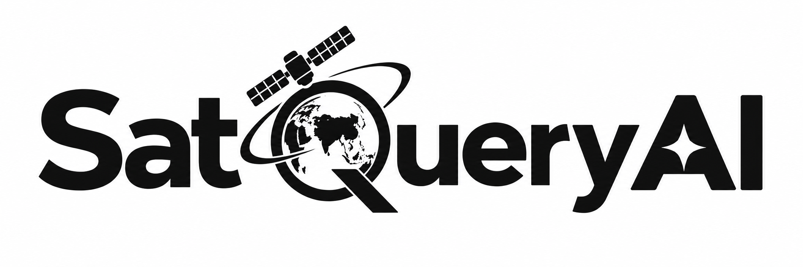

<p align="center">
  
</p>

<p align="center">
  <strong>Interactive Vision-Language Assistant for Multimodal Remote-Sensing Image Analysis through Text Queries</strong>
</p>

<p align="center">
  <b>Smart India Hackathon 2026</b> · Problem Statement <b>26167</b> · ISRO · Space Technology · Software
</p>

<p align="center">
  <a href="https://github.com/PoorvaJawale/northstar">Repository</a> ·
  <a href="https://northstar-satqueryai.vercel.app/">Live Prototype</a> .
  <a href="https://youtu.be/7En0ezBva5o?si=Fs_ogsMe1vB2gVgW​">Demo Video</a>
</p>

---

## 🌍 What is SatQuery AI?

**SatQuery AI** is an agentic vision-language assistant for remote-sensing imagery. Instead of requiring users to manually choose a GIS workflow or specialist model, users can upload satellite image(s) and ask a question in natural language.

The system then:

```text
Satellite Image(s) + Natural-Language Query
                    ↓
             Input Inspection
                    ↓
          Query Classification
                    ↓
        Specialist Model Selection
                    ↓
            Model Execution
                    ↓
           Evidence Fusion
                    ↓
       Answer + Visual Evidence
                    ↓
          Auditable Trace
```

The goal is to make multimodal satellite-image analysis more accessible while keeping specialist remote-sensing models behind a single conversational interface.

---

## 🎯 Smart India Hackathon 2026

| Detail                      | Information                                                                                                 |
| --------------------------- | ----------------------------------------------------------------------------------------------------------- |
| **Problem Statement**       | **26167**                                                                                                   |
| **Problem Statement Title** | SatQuery AI – Interactive Vision-Language Assistant for Multimodal Remote-Sensing Analysis via Text Queries |
| **Organization**            | Indian Space Research Organisation (ISRO)                                                                   |
| **Theme**                   | Space Technology                                                                                            |
| **Category**                | Software                                                                                                    |
| **Team**                    | NorthStar                                                                                                   |

---

## ✨ Core Capabilities

### 1. 🛰️ Single-Image Understanding

For a single satellite image, SatQuery AI supports:

- Visual Question Answering (VQA)
- Image captioning / scene description
- Text-guided visual grounding
- Natural-language questions about visible land-cover and objects

The current real single-image inference path uses **GeoChat**.

### 2. 🕐 Bi-Temporal Analysis

Two observations of the same region can be used for change-oriented queries such as:

> “What changed between these two dates?”

The architecture includes a dedicated change-analysis tool. The current repository keeps this path configurable and can run it in mock mode until the corresponding specialist model is supplied.

### 3. 📡 Optical + SAR Reasoning

SatQuery AI is designed to combine complementary information from optical and SAR imagery for cross-modal questions.

The optical–SAR path is exposed through the model/tool registry and is currently configurable/mock until the specialist model is supplied.

### 4. 🤖 Agentic Model Routing

The controller follows an agentic workflow:

`inspect → classify → select → execute → fuse → trace`

Models/tools are represented through a registry, allowing specialist capabilities to be added without redesigning the complete application.

### 5. 🔎 Evidence-Grounded Results

The application is designed to return more than a text answer. The result can include:

- Answer
- Visual evidence
- Confidence information
- Execution / reasoning trace

This makes the processing path observable rather than treating the system as a black-box chatbot.

---

## 🧠 Specialist Models

| Model / Component        | Role                                         | Current status                            |
| ------------------------ | -------------------------------------------- | ----------------------------------------- |
| **GeoChat**              | Remote-sensing VQA, captioning and grounding | **Real / live for single-image tasks**    |
| **ChangeFormer / BIT**   | Bi-temporal change analysis                  | Tool wired; specialist model configurable |
| **Optical-SAR Fusion**   | Cross-modal optical + SAR reasoning          | Tool wired; specialist model configurable |
| **Qwen2.5 / LLM Router** | Query classification and task routing        | Optional router path                      |

> The repository intentionally distinguishes implemented/live components from configurable or mock specialist paths. This keeps the SIH submission reproducible and avoids claiming model capabilities that are not currently wired to a verified checkpoint.

---

## 🛠️ Technology Stack

### Core AI / ML

- Python
- PyTorch
- Hugging Face
- PEFT / LoRA

### Backend

- FastAPI
- LangGraph
- Ollama
- Qwen2.5

### Frontend

- React
- Vite
- Tailwind CSS
- Leaflet

### Geospatial

- Rasterio
- GDAL

### Data & Storage

- FAISS
- Chroma
- PostgreSQL
- SQLite

### Cloud / Deployment

- Kaggle
- Google Colab
- Hugging Face Spaces
- Render

---

## 🧩 Supported Input Modes

### Single image

```text
ONE SATELLITE IMAGE
        ↓
GeoChat / specialist task
        ↓
VQA · Captioning · Grounding
```

### Bi-temporal pair

```text
IMAGE T1 + IMAGE T2
        ↓
Change-analysis workflow
        ↓
Change detection / Change-VQA
```

### Optical + SAR pair

```text
OPTICAL IMAGE + SAR IMAGE
        ↓
Cross-modal specialist workflow
        ↓
Optical–SAR reasoning
```

Primary geospatial formats include **GeoTIFF / TIFF**. PNG/JPEG can also be used for supported benchmark or demonstration inputs.

---

## 🏗️ Architecture

```text
┌─────────────────────────────────────────────────────────────┐
│                         USER INPUT                          │
│          Satellite Image(s) + Natural-Language Query       │
└──────────────────────────────┬──────────────────────────────┘
                               ↓
┌─────────────────────────────────────────────────────────────┐
│                    AI AGENT / QUERY ROUTER                  │
│       Inspect → Classify → Validate → Select Tool          │
└──────────────────────────────┬──────────────────────────────┘
                               ↓
             ┌─────────────────┼─────────────────┐
             ↓                 ↓                 ↓
       ┌───────────┐     ┌────────────┐    ┌──────────────┐
       │  GeoChat  │     │ Change     │    │ Optical-SAR  │
       │ VQA /     │     │ Analysis   │    │ Fusion       │
       │ Grounding │     │            │    │              │
       └─────┬─────┘     └──────┬─────┘    └──────┬───────┘
             └──────────────────┼─────────────────┘
                                ↓
                    ┌──────────────────────┐
                    │   EVIDENCE FUSION    │
                    └──────────┬───────────┘
                               ↓
                    ┌──────────────────────┐
                    │ ANSWER + EVIDENCE    │
                    │ + CONFIDENCE + TRACE │
                    └──────────────────────┘
```

---

## 🚀 Local Setup

### Reference environment

The verified GeoChat environment in the project documentation uses:

- Windows 11
- Python **3.11.9**
- NVIDIA RTX 3050 Laptop GPU, **6 GB VRAM**
- CUDA **12.1**
- PyTorch **2.5.1 + cu121**

GeoChat depends on an older Transformers stack, so the versions below are intentionally pinned.

### 1. Create / activate the environment

```powershell
python -m venv .venv311
.\.venv311\Scripts\Activate.ps1
python -c "import sys; print(sys.executable)"
```

### 2. Install the CUDA PyTorch build

```powershell
python -m pip install torch==2.5.1 torchvision==0.20.1 --index-url https://download.pytorch.org/whl/cu121
```

### 3. Install the pinned ML stack

```powershell
python -m pip install "transformers==4.31.0" "accelerate==0.27.2" "huggingface-hub==0.24.6" `
  "bitsandbytes==0.50.1" "peft==0.20.0" "sentencepiece==0.2.2" "einops==0.6.1" "timm==0.6.13"
```

### 4. Install web-app dependencies

```powershell
python -m pip install fastapi "uvicorn[standard]" pydantic python-multipart pyyaml jinja2
```

Optional geospatial / training dependencies:

```text
rasterio
lmdb
safetensors
pyarrow
pandas
```

> **Important:** Do not blindly upgrade `transformers`, `accelerate`, or `huggingface-hub`. The GeoChat runtime depends on the pinned compatibility set above.

---

## 🧠 GeoChat Setup

The project uses the **MBZUAI/geochat-7B** checkpoint for the live single-image inference path.

Download it to a local model directory and point the application to that directory:

```powershell
$env:HF_HOME = "D:\SIH2026\.hf-cache"
$env:HF_HUB_DISABLE_XET = "1"

hf download MBZUAI/geochat-7B --local-dir D:\SIH2026\models\geochat-7B
```

Then verify the standalone inference path:

```powershell
$env:GEOCHAT_MODEL = "D:\SIH2026\models\geochat-7B"
python infer.py --image test_rgb.png --query "Describe the land cover in this image."
```

A successful inference prints a question, answer and confidence result.

---

## 🌐 Run the Web Application

### Mock / architecture-demo mode

No GPU or downloaded model is required:

```powershell
$env:SATQUERY_MOCK = "1"
python -m uvicorn backend.main:app --host 127.0.0.1 --port 8000
```

Run the test suite:

```powershell
pytest -q
```

### Live GeoChat mode

```powershell
$env:SATQUERY_MOCK = "0"
$env:GEOCHAT_MODEL = "D:\SIH2026\models\geochat-7B"
python -m uvicorn backend.main:app --host 127.0.0.1 --port 8000
```

Open:

```text
http://localhost:8000
```

The live GeoChat path currently covers single-image tasks. Two-image change and optical–SAR paths remain configurable/mock until their specialist checkpoints are supplied.

---

## ⚙️ Configuration

| Variable            | Default             | Purpose                                  |
| ------------------- | ------------------- | ---------------------------------------- |
| `SATQUERY_MOCK`     | `1`                 | `0` enables real model paths             |
| `GEOCHAT_MODEL`     | `MBZUAI/geochat-7B` | Hugging Face ID or local checkpoint path |
| `GEOCHAT_CONV_MODE` | `llava_v1`          | GeoChat conversation template            |
| `GEOCHAT_LOAD_4BIT` | `1`                 | Enables 4-bit loading for limited VRAM   |
| `LORA_ADAPTER`      | empty               | Optional LoRA adapter path               |
| `CHANGE_MODEL`      | empty               | Specialist change model path             |
| `OPTICAL_SAR_MODEL` | empty               | Specialist optical–SAR model path        |
| `SATQUERY_USE_LLM`  | off in mock         | Enables LLM-based task routing           |
| `OLLAMA_MODEL`      | empty               | Ollama model used by the router          |

---

## 📁 Project Structure

```text
northstar/
├── backend/
│   ├── main.py                  # FastAPI application
│   ├── config.py                # Environment/configuration
│   ├── agent/                   # Agentic controller and routing logic
│   ├── tools/                   # Specialist tool interface + registry
│   │   ├── base.py
│   │   ├── registry.yaml
│   │   ├── geochat_tool.py
│   │   ├── geochat_runtime.py
│   │   ├── change_tool.py
│   │   └── optical_sar_tool.py
│   ├── geo/                     # GeoTIFF/TIFF/PNG handling
│   └── report/                  # Evidence report generation
├── frontend/                    # Web UI
├── training/                    # Fine-tuning / dataset preparation
├── kaggle/                      # Kaggle T4 fine-tuning guide
├── tests/                       # Agent tests
├── docs/                        # Fine-tuning and supporting documentation
├── infer.py                     # Standalone GeoChat inference
└── README.md
```

Large local assets such as model checkpoints, HF caches, datasets, uploads and virtual environments are intentionally excluded from Git.

---

## 🔬 Fine-Tuning Track

The SIH implementation includes a QLoRA-based fine-tuning track intended for a cloud T4 environment.

The training workflow is documented separately in:

```text
docs/FINE_TUNING.md
```

The intended output is a LoRA adapter that can be supplied to the live GeoChat path through `LORA_ADAPTER`.

---

## 📊 Evidence & Auditability

SatQuery AI is designed so that each request can expose an execution summary instead of returning only an opaque final answer.

The trace can represent stages such as:

```text
Query Classification
        ↓
Input / Modality Validation
        ↓
Specialist Selection
        ↓
Model Execution
        ↓
Evidence Fusion
        ↓
Final Answer
```

The tool registry is also designed to make specialist capabilities discoverable at runtime rather than embedding every model directly into the main application flow.

---

## 🎥 Demo

**Live prototype:** https://northstar-satqueryai.vercel.app/

The SIH submission also includes a live prototype / demo reference in the presentation materials.

---

## 👥 Team NorthStar

| Contributor         | Role / contribution |
| ------------------- | ------------------- |
| **Poorva Jawale**   | Team member         |
| **Om Ingale**       | Team member         |
| **Kartik Halkunde** | Team member         |
| **Sahil Karpe**     | Team member         |
| **Nikita Solanki**  | Team member         |
| **Lavanya Singh**   | Team member         |

> The repository is a collaborative SIH 2026 final-submission project by Team NorthStar.

---

## 📚 Research & References

The project builds on remote-sensing datasets and prior work used for model development and evaluation, including:

- **RSVQA-LR** — GeoChat fine-tuning
- **BigEarthNet / BigEarthNet v2.0** — planned / training data work
- **Sen1Floods11** — SAR flood segmentation
- **VRSBench** — evaluation benchmark
- **CDVQA** — change-detection VQA evaluation
- **RSVQA** — broader evaluation

Referenced model / research areas include:

- GeoChat — MBZUAI
- EarthGPT
- ChangeFormer
- Optical–SAR fusion research

---

## 📌 Current Implementation Status

| Component                      | Status                                                      |
| ------------------------------ | ----------------------------------------------------------- |
| Agentic controller             | Implemented                                                 |
| Tool/model registry            | Implemented                                                 |
| Single-image GeoChat inference | **Live / real**                                             |
| Single-image VQA               | **Live / real**                                             |
| Captioning / grounding path    | **Live through GeoChat tooling**                            |
| Bi-temporal change tool        | Configurable / mock until specialist checkpoint is supplied |
| Optical–SAR fusion tool        | Configurable / mock until specialist checkpoint is supplied |
| QLoRA fine-tuning track        | Separate training track                                     |
| Auditable execution trace      | Implemented                                                 |
| Web application                | Implemented                                                 |

This status table intentionally separates the working application architecture from specialist models that still need their final trained checkpoints.

---

## ⚠️ Reproducibility Notes

The GeoChat runtime has strict dependency compatibility requirements. In particular:

- `transformers==4.31.0`
- `accelerate==0.27.2`
- `huggingface-hub==0.24.6`
- `bitsandbytes==0.50.1`
- `peft==0.20.0`

Changing these versions can break the GeoChat loading path.

For the 6 GB reference GPU environment, 4-bit model loading is used to keep inference within available VRAM.

---

## 🙌 Acknowledgement

SatQuery AI is developed for **Smart India Hackathon 2026**, Problem Statement **26167**, under the **Space Technology** theme and the ISRO problem context.

The project builds on open-source remote-sensing research, datasets and models from the wider Earth-observation and vision-language research community.

---

## 📄 License

A project license is not specified in the supplied submission materials. Add the repository's intended license here once the team has selected one.

---

<p align="center">
  <b>SatQuery AI · Team NorthStar · SIH 2026</b>
</p>
